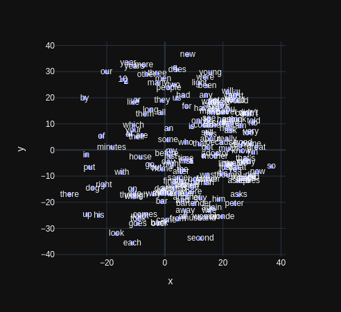
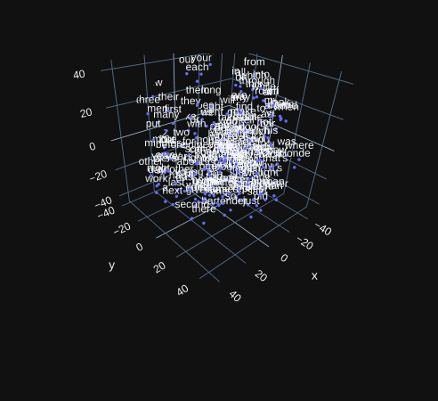
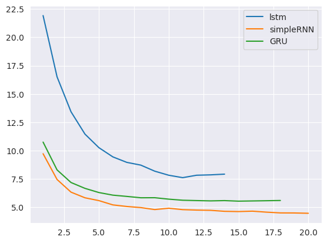

# Entrega Final - Procesamiento del Lenguaje natural

**Alumno:** Juan Cruz Piñero

Este es un fork del repositorio original de la materia, por eso tambien contiene el material de clases (presentaciones, ejercicios y notebooks) para NLP (CEIA - FIUBA).

Por otro lado, en la carpeta [Entrega Final](Entrega_Final) se encuentran todas las resoluciones correpsondientes a los desafios propuestos en el bimestre 012025.

A continuación se presenta el contenido y una breve explicación de cada desafio, a modo de resumen de lo realizado durante el curso.


## Contenido de la entrega

### [Desafio 1](Entrega_Final/Desafio1/Desafio_1.ipynb) 

El desafío 1 consistio en el entrenamiento de un vectorizador de texto.
Se utilizo el dataset provisto en el notebook de ejemplo (news groups / noticias agrupadas por categoría) para el desarrollo de las siguientes tareas:
- Entrenamiento de un vectorizador de texto 
- Medición de similaridad coseno ente todos los documentos del dataset.
  - En este punto pudimos ver, p.ej que luego del entrenamiento, los documentos más similares a 5 elegidos al azar. comprobando que a partir de la vectorización los documentos más cercanos eran de la misma categoría o similares. Visualizando el contenido de los textos 'cercanos' pudimos constatar que había términos o temáticas repetidas y que la similaridad tenía sentido.
- Entrenamiento de modelos de clasificación. 
  - Se entrenaron varios modelos a partir de los vectores obtenidos en el tokenizador variando parametros tanto del tokenizador como del modelo. Donde los modelos que mejor performaron fueron los siguientes:
```
+-------------------------+------------+
| Model                     |  F1 Score |
+=========================+============+
| naive_bayes_default     |    0.5854 |
+-------------------------+------------+
| naive_bayes_alpha1e_5   |    0.64   |
+-------------------------+------------+
| complement_NB_default   |    0.693  |
+-------------------------+------------+
| complement_NB_alpha1e_5 |    0.6119 |
+-------------------------+------------+
```
- Finalmente se evaluo la similaridad entre terminos usando la trasnpuesta de la matriz documento - término. Viendo, por ejemplo, que los terminos mas similares a 'budapest' eran \['budapest', 'judenrat', 'palgi', 'perdition', 'nazr'\].
### [Desafio 2](Entrega_Final/Desafio2/Desafio2.ipynb) 
En el desafio 2 entrenamos embeddings de términos con Gensim, sobre un dataset a elección. En mi caso fue un dataset de bromas en inglés.

Luego de hacer un preprocesamiento del dataset, segmentando los textos en palabras, y entrenando un modelo Word2Vec basado en arquitectura 'SkipGram'.

En el notebook se testeo el modelo mediante la funcion most_similar viendo que efectivamente palabras relacionadas resultaban en vectores similares.

Finalmente visualizamos la similaridad entre palabras usando la herramienta TSNE que permite graficar espacios de alta dimensionalidad en 2/3 dimensiones.

Obteniendo una representación visual de las distancias entre palabras del corpus.




### [Desafio 3](Entrega_Final/Desafio3/Desafio3.ipynb) 
En el desafio 3 entrenamos un modelo de lenguaje con tokenización por caracteres.
Para esto se hizo uso de 3 arquitecturas/elementos (disponibles en keras) vistas en el curso:
- GRU (Gated recurrent unit)
- LSTM (Long short term memory)
- SimpleRNN (Simple recurrent unit)
Utilice un dataset de abstracts de papers sobre AI / machine learning.

Durante el preprocesamiento arme un solo gran documento que luego se segmento para el entrenamiento en elementos de tamaño de contexto utilizado.

La tokenización se hizo a partir de indexar los caracteres presentes en el corpus.


Una vez obtenido el texto tokenizado se separo en secuencias de train y validacion, donde las segundas eran simplemente la primera + el siguiente caracter, ya que la tarea del modelo era predecir el siguiente caracter basandose en la secuencia de entrada.

Para el entrenamiento se agrego como métrica de validación un callback adhoc que hacia una estimacióin de perplejidad y que fue provisto por los docentes.



#### Beam search y greedy search

Los modelos entrenados se probaron generando secuencias con las estrategias beam search (variando el parametro temperatura) y con busqueda 'determinista'.

Si bien la performance no resulto demasiado sorprendente, los resultados fueron lógicos dadas las estructuras, parámetros y el dataset empleados. 

Ademas pude ver que la estrategia beam search con temperatura 0.5 era lógica y la estrategia beam search resultaba en seencias de caracteres ilogicas si se subia demasiado la temperatura.


### [Desafio 4](Entrega_Final/desafio4.ipyinb) 
* Redes recurrentes (RNN)
* Problemas de secuencia
* Estimación de próxima palabra


# Profesores
:octocat: Dr. Rodrigo Cardenas Szigety (2022-actual)\
:octocat: Dr. Nicolás Vattuone (2025-actual)\

